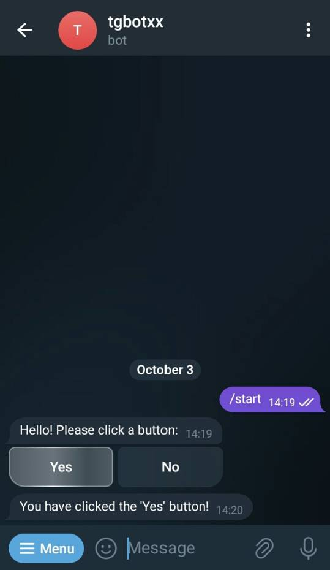

<!--
> **Warning**
>
> this library is still under development.
>
  
-->
[](https://github.com/baderouaich/tgbotxx/blob/main/LICENSE)
[](https://baderouaich.github.io/tgbotxx)
[](https://img.shields.io/badge/C++-20-blue.svg?style=flat&logo=c%2B%2B)

# tgbotxx

Telegram Bot C++ Library

Compatible with Telegram [Bot API 6.9 (September 22, 2023)](https://core.telegram.org/bots/api-changelog)

### CI Status

| Operating system | Build status                                                                                                                                                                                      |
|------------------|---------------------------------------------------------------------------------------------------------------------------------------------------------------------------------------------------|
| Ubuntu (x64)     | [](https://github.com/baderouaich/tgbotxx/actions/workflows/build-ubuntu.yml)    |
| Windows (x64)    | [](https://github.com/baderouaich/tgbotxx/actions/workflows/build-windows.yml) |
| macOS            | [](https://github.com/baderouaich/tgbotxx/actions/workflows/build-macos.yml)       | 

### Examples

> see [examples](examples/) for more

| Example                                                  | Description                                                                                               |                                           Preview                                           |
|:---------------------------------------------------------|:----------------------------------------------------------------------------------------------------------|:-------------------------------------------------------------------------------------------:|
| [WeatherBot](examples/WeatherBot)                        | Bot that displays the weather information of a city using the [weather api](https://www.weatherapi.com/). |                    |
| [EarthquakeBot](examples/EarthquakeBot)                  | Bot that will alert you if there is a recent earthquake somewhere in the world.                           |                  |
| [QrCodeBot](examples/QrCodeBot)                          | Bot that can generate QrCode images from text and extract text from QrCode Images.                        |                      |
| [UrlShortenerBot](examples/UrlShortenerBot)              | Bot for shortening URLs.                                                                                  |               |
| [Inline Buttons](examples/Buttons/InlineKeyboardButton)  | Bot that uses inline keyboard buttons to interact with users.                                             |  |
| [Keyboard Buttons](examples/Buttons/ReplyKeyboardMarkup) | Bot that uses keyboard buttons to interact with users.                                                    |   |
| [PaidSubscriptionBot](examples/PaidSubscriptionBot)      | Bot that offers it's services for a paid subscription.                                                    |      |

[//]: # (### Usage)

[//]: # ()

[//]: # (This library is using Inheritance-Based Extensibility technique providing a Bot class which you can inherit from)

[//]: # (and optionally override callback events depending on your Bot needs.)

[//]: # ()

[//]: # (This also allows you to instantiate multiple bots in the same program. Just make sure each Bot is running on a separate)

[//]: # (thread. )

#### Basic sample

> see [examples](examples/) for more

```cpp
#include <tgbotxx/tgbotxx.hpp>
#include <iostream>
using namespace tgbotxx;

class MyBot : public Bot {
public:
  MyBot() : Bot("BOT_TOKEN_FROM_BOT_FATHER") {}
    
private:
  void onStart() override {
    // Called before Bot starts receiving updates
    // Initialize your code here...
    std::cout << "Bot Started\n";
  }
  void onStop() override {
    // Called before Bot shuts down (triggered by Bot::stop())
    // Cleanup your code here
    std::cout << "Bot Stopped\n";
  }
  void onAnyMessage(const Ptr<Message>& message) override {
    // Called when Bot receives a new message of any kind
    // NB: a Ptr<T> is just an alias to std::shared_ptr<T>
    api()->sendMessage(message->chat->id, "Hi " + message->from->firstName + "!, got your message!");
  }
  // override other callbacks if needed... 
};

int main() {
  MyBot bot;
  bot.start();
  return 0;
}
```

#### Extensive sample

Creating a new Bot called `MyBot` that overrides all callbacks:
<details>
<summary>Show</summary>

```cpp
#include <tgbotxx/tgbotxx.hpp>
#include <iostream>
using namespace tgbotxx;

class MyBot : public Bot {
public:
    MyBot() : Bot("BOT_TOKEN_FROM_BOT_FATHER") {}

private:
    /// Called before Bot starts receiving updates (triggered by Bot::start())
    /// Use this callback to initialize your code, set commands..
    void onStart() override {
      // Drop awaiting updates (when Bot is not running, updates will remain 24 hours
      // in Telegram server before they get deleted or retrieved by BOT)
      api()->deleteWebhook(true);

      // Register bot commands ...
      Ptr<BotCommand> greet(new BotCommand());
      greet->command = "greet";
      greet->description = "This command will greet you";
      Ptr<BotCommand> stop(new BotCommand());
      stop->command = "stop";
      stop->description = "Stop the bot";
      api()->setMyCommands({greet, stop}); // The above commands will be shown in the bot chat menu (bottom left)
      
      std::cout << "Bot " << api()->getMe()->username << " Started\n";
    }
    
    /// Called when Bot is about to be stopped (triggered by Bot::stop())
    void onStop() override {
      /// Cleanup your code in this callback (close handles, backup data...)
      std::cout << "Bot " << api()->getMe()->username << " Stopped\n";
    }
    
    /// Called when a new message is received of any kind - text, photo, sticker, etc.
    void onAnyMessage(const Ptr<Message>& message) override {
        api()->sendMessage(message->chat->id, "Hi " + message->from->firstName + "!, got your message!");
    }
    
    /// Called when a new command is received (messages with leading '/' char).
    void onCommand(const Ptr<Message>& message) override {
      if(message->text == "/stop") {
        api()->sendMessage(message->chat->id, "Bot stopping...");
        Bot::stop();
        return;
      }
    }
    
    /// Called when long polling fails
    void onLongPollError(const std::string& reason) override {
      std::cerr <<  "Long polling error: " << reason << std::endl;
    }
    
    // Other callbacks (optional overload)
    /// Called when a non-command message is received of any kind - text, photo, sticker, etc.
    void onNonCommandMessage(const Ptr<Message> &message) override {}
    /// Called when an unknown command is received (messages with leading '/' char).
    /// Known commands are set with Bot::setCommands()
    void onUnknownCommand(const Ptr<Message> &message) override {}
    /// Called when a new version of a message that is known to the bot and was edited
    void onEditedMessage(const Ptr<Message>& editedMessage) override {}
    /// Called when a new incoming inline query is received
    void onInlineQuery(const Ptr<InlineQuery>& inlineQuery) override {}
    /// Called when the result of an inline query that was chosen by a user and sent to their chat partner.
    void onChosenInlineResult(const Ptr<ChosenInlineResult>& chosenInlineResult) override {}
    /// Called when a new incoming callback query is received
    void onCallbackQuery(const Ptr<CallbackQuery>& callbackQuery) override {}
    /// Called when a new incoming shipping query is received.
    void onShippingQuery(const Ptr<ShippingQuery>& shippingQuery) override {}
    /// Called when a new incoming pre-checkout query is received. Contains full information about checkout
    void onPreCheckoutQuery(const Ptr<PreCheckoutQuery>& preCheckoutQuery) override {}
    /// Called when a new poll state is received.
    void onPoll(const Ptr<Poll>& poll) override {}
    /// Called when a user changed their answer in a non-anonymous poll.
    void onPollAnswer(const Ptr<PollAnswer>& pollAnswer) override {}
    /// Called when the bot's chat member status was updated in a chat.
    void onMyChatMember(const Ptr<ChatMemberUpdated>& myChatMemberUpdated) override {}
    /// Called when a chat member's status was updated in a chat.
    void onChatMember(const Ptr<ChatMemberUpdated>& chatMemberUpdated) override {}
    /// Called when a request to join the chat has been sent.
    void onChatJoinRequest(const Ptr<ChatJoinRequest>& chatJoinRequest) override {}
};

int main() {
  MyBot bot;
  bot.start();
  return 0;
}
```

</details>

### Usage (4 approaches)

#### 1. `FetchContent` *(recommended)*

Simply use CMake's `FetchContent` in your project's `CMakeLists.txt` as below:

```cmake
cmake_minimum_required(VERSION 3.10)
project(my_bot)

set(CMAKE_CXX_STANDARD 20)
set(CMAKE_CXX_STANDARD_REQUIRED ON)

include(FetchContent)
FetchContent_Declare(tgbotxx
  GIT_REPOSITORY "https://github.com/baderouaich/tgbotxx"
  GIT_TAG main
)
FetchContent_MakeAvailable(tgbotxx)

add_executable(${PROJECT_NAME} main.cpp)
target_link_libraries(${PROJECT_NAME} PUBLIC tgbotxx)
```

#### 2. `PkgConfig`: clone and install the library locally, then use PkgConfig:

<details>
  <summary>example</summary>

```shell
git clone https://github.com/baderouaich/tgbotxx
cd tgbotxx
cmake .. -DCMAKE_BUILD_TYPE=Release
sudo make install 
# On Windows run `make install` as administrator 
```

```cmake
cmake_minimum_required(VERSION 3.10)
project(my_bot)

set(CMAKE_CXX_STANDARD 20)
set(CMAKE_CXX_STANDARD_REQUIRED ON)

find_package(PkgConfig REQUIRED)
pkg_check_modules(tgbotxx REQUIRED tgbotxx)

if (NOT tgbotxx_FOUND)
  message(FATAL_ERROR "Did you install tgbotxx locally?")
endif ()

add_executable(${PROJECT_NAME} main.cpp)
target_link_directories(${PROJECT_NAME} PUBLIC ${tgbotxx_LIBRARY_DIRS})
target_include_directories(${PROJECT_NAME} PUBLIC ${tgbotxx_INCLUDE_DIRS})
target_compile_options(${PROJECT_NAME} PUBLIC ${tgbotxx_CFLAGS_OTHER})
target_link_libraries(${PROJECT_NAME} PUBLIC ${tgbotxx_LIBRARIES})
```

</details>

#### 3. `find_package`: clone and install the library locally, then use find_package(tgbotxx REQUIRED):

<details>
  <summary>example</summary>

```cmake
cmake_minimum_required(VERSION 3.10)
project(my_bot)

set(CMAKE_CXX_STANDARD 20)
set(CMAKE_CXX_STANDARD_REQUIRED ON)

find_package(tgbotxx REQUIRED)

if (NOT tgbotxx_FOUND)
  message(FATAL_ERROR "Did you install tgbotxx locally?")
endif ()

add_executable(${PROJECT_NAME} main.cpp)
target_link_directories(${PROJECT_NAME} PUBLIC ${tgbotxx_LIBRARY_DIRS})
target_include_directories(${PROJECT_NAME} PUBLIC ${tgbotxx_INCLUDE_DIRS})
target_compile_options(${PROJECT_NAME} PUBLIC ${tgbotxx_CFLAGS_OTHER})
target_link_libraries(${PROJECT_NAME} PUBLIC ${tgbotxx_LIBRARIES})
```

</details>

#### 4. `Submodule`: Use tgbotxx as a project submodule (without installation)

<details>
  <summary>example</summary>

You can also use this library as a submodule in your bot project without the need of installing it in your system.
Use git clone or git submodule add the library:

```shell
git submodule add https://github.com/baderouaich/tgbotxx ./lib/tgbotxx
```

or

```shell
git clone https://github.com/baderouaich/tgbotxx ./lib/tgbotxx
```

Then add `add_subdirectory(lib/tgbotxx)` in your `CMakeLists.txt`.

```cmake
cmake_minimum_required(VERSION 3.10)
project(my_bot)

add_subdirectory(lib/tgbotxx) # <-- clone tgbotxx in your project's lib/ directory

add_executable(${PROJECT_NAME} main.cpp)
target_link_libraries(${PROJECT_NAME} PUBLIC tgbotxx) # <-- link with tgbotxx
```

</details>


### Other actively maintained Telegram Bot C++ Libraries
- [tgbot-cpp](https://github.com/reo7sp/tgbot-cpp): C++ library for Telegram bot API
- [tgbot](https://github.com/egorpugin/tgbot): C++ library for Telegram Bot API with generated API types and methods

### Refs:

[Telegram Api Documentation](https://core.telegram.org/bots/api)

