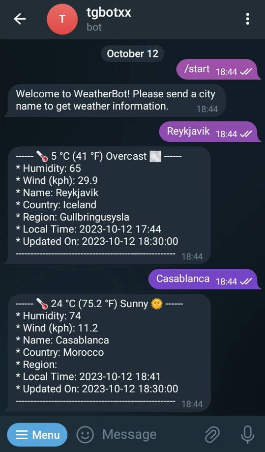

<!--
> **Warning**
>
> this library is still under development.
>
  
-->
[](https://github.com/baderouaich/tgbotxx/blob/main/LICENSE)
[](https://baderouaich.github.io/tgbotxx)
[](https://img.shields.io/badge/C++-20-blue.svg?style=flat&logo=c%2B%2B)

# tgbotxx

Telegram Bot C++ Library

## Features
- Compatible with Telegram [Bot API 9.2 (August 15, 2025)](https://core.telegram.org/bots/api-changelog)
- Simple, Fast and Reliable.
- Uses [libcpr](https://github.com/libcpr/cpr) for HTTP requests and [nlohmann::json](https://github.com/nlohmann/json) for JSON parsing (Both are exposed to the user by default)
- Cross Platform (Ubuntu, Windows and macOS)
- Plenty of [examples](examples/)
- MIT License
- C++ 20


[//]: # (### Third party libs)

[//]: # (- [nlohmann-json]&#40;https://github.com/nlohmann/json&#41; for JSON parsing)

[//]: # (- [cpr]&#40;https://github.com/libcpr/cpr&#41; for HTTP client)

### CI Status

| Operating system | Build status                                                                                                                                                                                      |
|------------------|---------------------------------------------------------------------------------------------------------------------------------------------------------------------------------------------------|
| Ubuntu (x64)     | [](https://github.com/baderouaich/tgbotxx/actions/workflows/build-ubuntu.yml)    |
| Windows (x64)    | [](https://github.com/baderouaich/tgbotxx/actions/workflows/build-windows.yml) |
| macOS            | [](https://github.com/baderouaich/tgbotxx/actions/workflows/build-macos.yml)       | 

[//]: # (### Usage)

[//]: # ()

[//]: # (This library is using Inheritance-Based Extensibility technique providing a Bot class which you can inherit from)

[//]: # (and optionally override callback events depending on your Bot needs.)

[//]: # ()

[//]: # (This also allows you to instantiate multiple bots in the same program. Just make sure each Bot is running on a separate)

[//]: # (thread. )

#### Basic sample

> see [examples](examples/) for more

```cpp
#include <tgbotxx/tgbotxx.hpp>
#include <iostream>
using namespace tgbotxx;

class MyBot final : public Bot {
public:
  MyBot() : Bot("Bot token here from @BotFather") {}
    
private:
  // Called before Bot starts receiving updates
  void onStart() override {
    // Initialize your code here...
    std::cout << "Bot Started\n";
  }
  
  // Called before Bot shuts down (triggered by Bot::stop())
  void onStop() override {
    // Cleanup your code here
    std::cout << "Bot Stopped\n";
  }
  
  // Called when Bot receives a new message of any kind
  // NB: Ptr<T> = std::shared_ptr<T>
  void onAnyMessage(const Ptr<Message>& message) override {
    std::string reply = "Hi " + message->from->firstName + ", got your message!";
    api()->sendMessage(message->chat->id, reply);
  }
  
  // override other callbacks if needed... See Bot.hpp
};

int main() {
  MyBot bot;
  bot.start();
  return 0;
}
```
### Examples

> see [examples](examples/) for more

| Example                                                       | Description                                                                                                                      |                                           Preview                                           |
|:--------------------------------------------------------------|:---------------------------------------------------------------------------------------------------------------------------------|:-------------------------------------------------------------------------------------------:|
| [WeatherBot](examples/WeatherBot)                             | Bot that displays the weather information of a city using the [weather api](https://www.weatherapi.com/).                        |                    |
| [EarthquakeBot](examples/EarthquakeBot)                       | Bot that will alert you if there is a recent earthquake somewhere in the world.                                                  |                  |
| [QrCodeBot](examples/QrCodeBot)                               | Bot that can generate QrCode images from text and extract text from QrCode Images.                                               |                      |
| [UrlShortenerBot](examples/UrlShortenerBot)                   | Bot for shortening URLs.                                                                                                         |               |
| [Inline Buttons](examples/Buttons/InlineKeyboardButton)       | Bot that uses inline keyboard buttons to interact with users.                                                                    |  |
| [Keyboard Buttons](examples/Buttons/ReplyKeyboardMarkup)      | Bot that uses keyboard buttons to interact with users.                                                                           |   |
| [PaidSubscriptionBot](examples/PaidSubscriptionBot)           | Bot that offers it's services for a paid subscription.                                                                           |      |
| [ThreadPoolBot](examples/ThreadPoolBot)                       | Bot that uses a ThreadPool to handle multiple requests simultaneously.                                                           |                |
| [GitWatcherBot](https://github.com/baderouaich/GitWatcherBot) | Real world Bot that you can use to watch repositories changes and get notified about (stars, forks, issues, watchers and pulls). |                       |

</details>

### Usage (4 approaches)

#### 1. `FetchContent` *(recommended)*

Simply use CMake's `FetchContent` in your project's `CMakeLists.txt` as below:

```cmake
cmake_minimum_required(VERSION 3.20)
project(my_bot)

set(CMAKE_CXX_STANDARD 20)
set(CMAKE_CXX_STANDARD_REQUIRED ON)

include(FetchContent)
FetchContent_Declare(tgbotxx
        GIT_REPOSITORY "https://github.com/baderouaich/tgbotxx"
        GIT_TAG "v1.2.9.2" # Compatible with Telegram Api 9.2
        GIT_SHALLOW TRUE
        GIT_PROGRESS TRUE
        EXCLUDE_FROM_ALL
)
FetchContent_MakeAvailable(tgbotxx)

add_executable(${PROJECT_NAME} main.cpp)
target_link_libraries(${PROJECT_NAME} PUBLIC tgbotxx)
```

#### 2. `PkgConfig`: clone and install the library locally, then use PkgConfig:

<details>
  <summary>example</summary>

```shell
git clone https://github.com/baderouaich/tgbotxx
cd tgbotxx
cmake .. -DCMAKE_BUILD_TYPE=Release
sudo make install 
# On Windows run `make install` as administrator 
```

```cmake
cmake_minimum_required(VERSION 3.20)
project(my_bot)

set(CMAKE_CXX_STANDARD 20)
set(CMAKE_CXX_STANDARD_REQUIRED ON)

find_package(PkgConfig REQUIRED)
pkg_check_modules(tgbotxx REQUIRED tgbotxx)

if (NOT tgbotxx_FOUND)
    message(FATAL_ERROR "Did you install tgbotxx locally?")
endif ()

add_executable(${PROJECT_NAME} main.cpp)
target_link_directories(${PROJECT_NAME} PUBLIC ${tgbotxx_LIBRARY_DIRS})
target_include_directories(${PROJECT_NAME} PUBLIC ${tgbotxx_INCLUDE_DIRS})
target_compile_options(${PROJECT_NAME} PUBLIC ${tgbotxx_CFLAGS_OTHER})
target_link_libraries(${PROJECT_NAME} PUBLIC ${tgbotxx_LIBRARIES})
```

</details>

#### 3. `find_package`: clone and install the library locally, then use find_package(tgbotxx REQUIRED):

<details>
  <summary>example</summary>

```cmake
cmake_minimum_required(VERSION 3.20)
project(my_bot)

set(CMAKE_CXX_STANDARD 20)
set(CMAKE_CXX_STANDARD_REQUIRED ON)

find_package(tgbotxx REQUIRED)

if (NOT tgbotxx_FOUND)
    message(FATAL_ERROR "Did you install tgbotxx locally?")
endif ()

add_executable(${PROJECT_NAME} main.cpp)
target_link_directories(${PROJECT_NAME} PUBLIC ${tgbotxx_LIBRARY_DIRS})
target_include_directories(${PROJECT_NAME} PUBLIC ${tgbotxx_INCLUDE_DIRS})
target_compile_options(${PROJECT_NAME} PUBLIC ${tgbotxx_CFLAGS_OTHER})
target_link_libraries(${PROJECT_NAME} PUBLIC ${tgbotxx_LIBRARIES})
```

</details>

#### 4. `Submodule`: Use tgbotxx as a project submodule (without installation)

<details>
  <summary>example</summary>

You can also use this library as a submodule in your bot project without the need of installing it in your system.
Use git clone or git submodule add the library:

```shell
git submodule add https://github.com/baderouaich/tgbotxx ./lib/tgbotxx
```

or

```shell
git clone https://github.com/baderouaich/tgbotxx ./lib/tgbotxx
```

Then add `add_subdirectory(lib/tgbotxx)` in your `CMakeLists.txt`.

```cmake
cmake_minimum_required(VERSION 3.20)
project(my_bot)

add_subdirectory(lib/tgbotxx) # <-- clone tgbotxx in your project's lib/ directory

add_executable(${PROJECT_NAME} main.cpp)
target_link_libraries(${PROJECT_NAME} PUBLIC tgbotxx) # <-- link with tgbotxx
```

</details>

### Other actively maintained Telegram Bot C++ Libraries

- [tgbot-cpp](https://github.com/reo7sp/tgbot-cpp): C++ library for Telegram bot API
- [tgbot](https://github.com/egorpugin/tgbot): C++ library for Telegram Bot API with generated API types and methods

### Refs:

[Telegram Api Documentation](https://core.telegram.org/bots/api)

