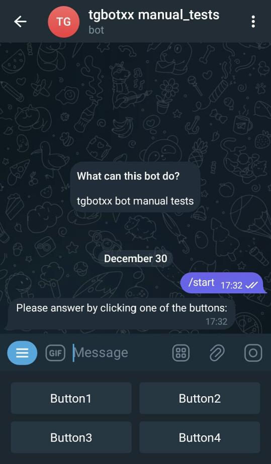

## Keyboard Buttons
This example shows how to program a basic Telegram Bot that uses keyboard buttons to interact with users.

Bots are able to interpret free text input from users, but offering specific suggestions is often more intuitive – this is where custom keyboards can be extremely useful.

Whenever your bot sends a message, it can display a special keyboard with predefined reply options (see ReplyKeyboardMarkup). Telegram apps that receive the message will display your keyboard to the user. Using any of the buttons will immediately send the respective text. This way you can drastically simplify and streamline user interaction with your bot.


### Run
```bash
mkdir build && cd build
cmake .. -DCMAKE_BUILD_TYPE=Release
make -j8
./keyboard_buttons YOUR_BOT_TOKEN
```

### How to create a new Bot and obtain its private token ?
1. Open the Telegram mobile app and search BotFather
2. Send BotFather a command /newbot
3. Follow instructions to create a new Bot
4. After you finish the instructions, you will receive a Bot Token, make sure you keep it secured.

### Preview

