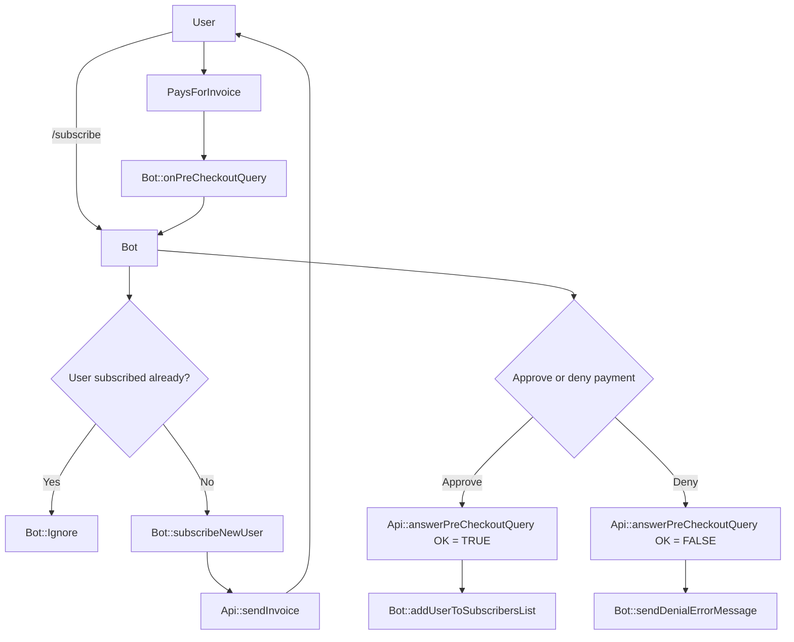
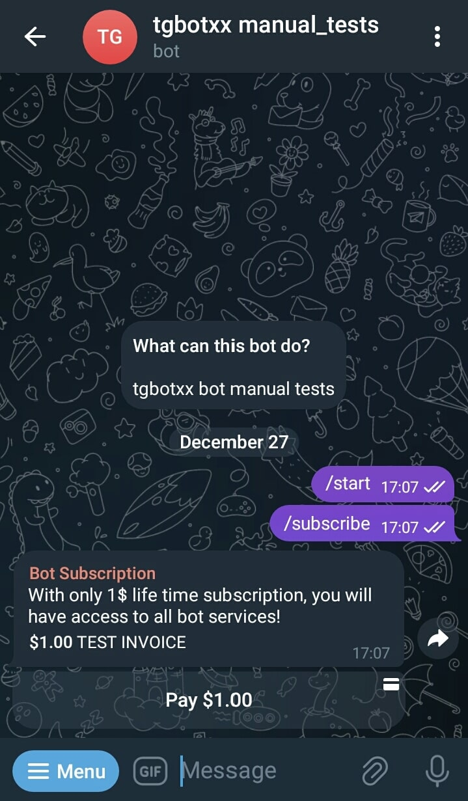
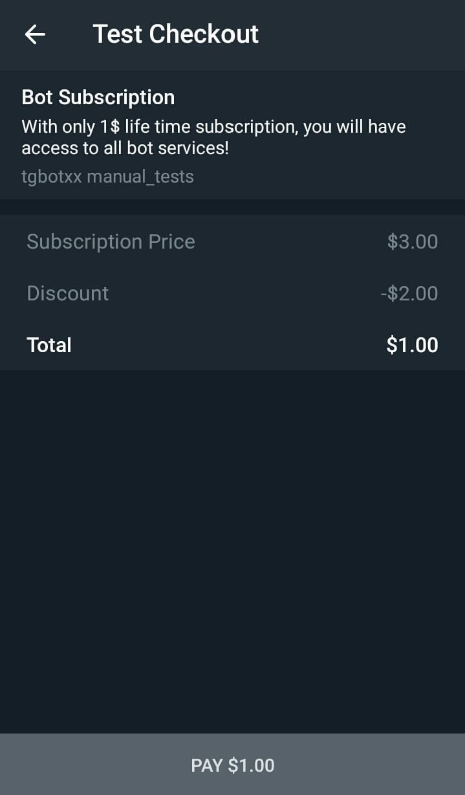
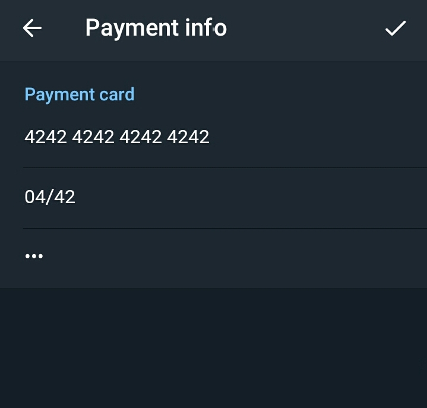
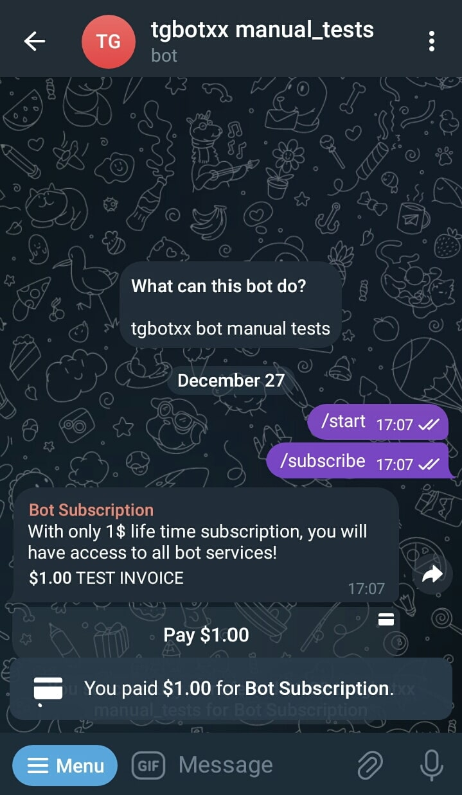

## Paid subscription bot using Payments api methods
This example shows how to program a Telegram Bot that charges for its services using the [api payments methods](https://core.telegram.org/bots/api#payments). 

### Run
```bash
mkdir build && cd build
cmake .. -DCMAKE_BUILD_TYPE=Release
make -j8
./paid_subscription_bot YOUR_BOT_TOKEN YOUR_PAYMENT_PROVIDER_TOKEN
```

### How to create a new Bot and obtain its private token ?
1. Open the Telegram mobile app and search BotFather
2. Send BotFather a command /newbot
3. Follow instructions to create a new Bot
4. After you finish the instructions, you will receive a Bot Token, make sure you keep it secured.


### How to obtain a payment provider token ?
1. Open the Telegram mobile app and search BotFather
2. Send BotFather a command /mybots
3. Click your bot 
4. Click Payments
5. Choose your payment provider and follow instructions to get your payment provider token, make sure you keep it secured.


### How to test an invoice payment ?
Never use real money to test your Bot invoice payments. Telegram has a testing card which you can use to pay for your testing invoices:<br>
see [Testing payments](https://core.telegram.org/bots/payments#testing-payments-the-39stripe-test-mode-39-provider)<br>
Simply use card info: <br>
**Card number** `42 42 42 42 42 42 42 42`<br>
**CVV** `any`<br>
**Expiration Date** `any`

Using this testing card will perform an invoice payment callback to your bot and will trigger the `Bot::onPreCheckoutQuery`, then you will have to
answer to the query in less than 10s with `Api::answerPreCheckoutQuery` to confirm or deny the payment. 

### Flowchart



### Preview







<!--
To 
**Create a testing invoice using [@ShopBot](https://t.me/shopbot) for testing purposes:**
<br>
1. Open the Telegram mobile app and search @ShopBot
2. Send ShopBot a command /invoice
3. Follow instructions then click Send Invoice button

## Testing Invoice & Payments
Never use real money to test your Bot invoice and payments. Telegram has a testing bots
specifically made for this purpose [@ShopBot](https://t.me/shopbot) & [@TestStore](https://t.me/teststore), see [payments](https://core.telegram.org/bots/payments#introducing-payments-2-0)
-->
