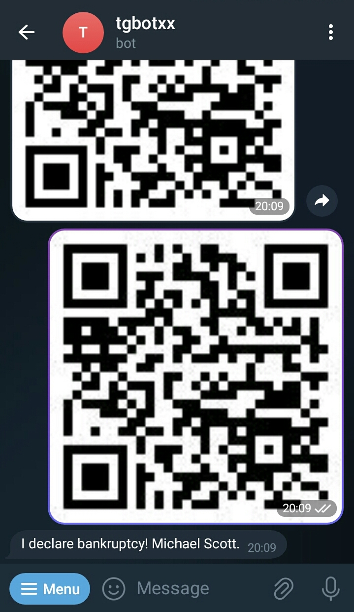

## QR Code Bot
This example shows how to program a Telegram Bot that can generate QrCode images from text and extract text from QrCode Images.

### Run
```bash
mkdir build && cd build
cmake .. -DCMAKE_BUILD_TYPE=Release
make -j8
./qrcode_bot YOUR_BOT_TOKEN
```

### How to create a new Bot and obtain its private token ?
1. Open the Telegram mobile app and search BotFather
2. Send BotFather a command /newbot
3. Follow instructions to create a new Bot
4. After you finish the instructions, you will receive a Bot Token, make sure you keep it secured.

### Encode (Text to QRCode Image)


### Decode (QRCode Image to Text)
