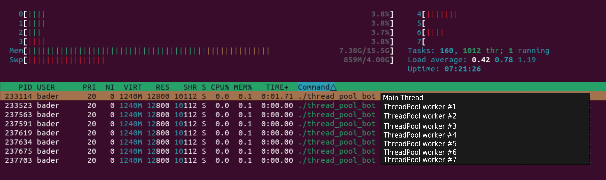

## Thread Pool Bot
This example shows how to program a Telegram Bot that handles loads of requests
using pre included `cpr::ThreadPool` (same approach with other threadpools).

If your Bot is facing high demand in a Group or has thousands of users, you should
consider using a Thread Pool that can handle multiple user requests simultaneously.

### Run
```bash
mkdir build && cd build
cmake .. -DCMAKE_BUILD_TYPE=Release
make -j8
./thread_pool_bot YOUR_BOT_TOKEN
```

### Previous

<br>
