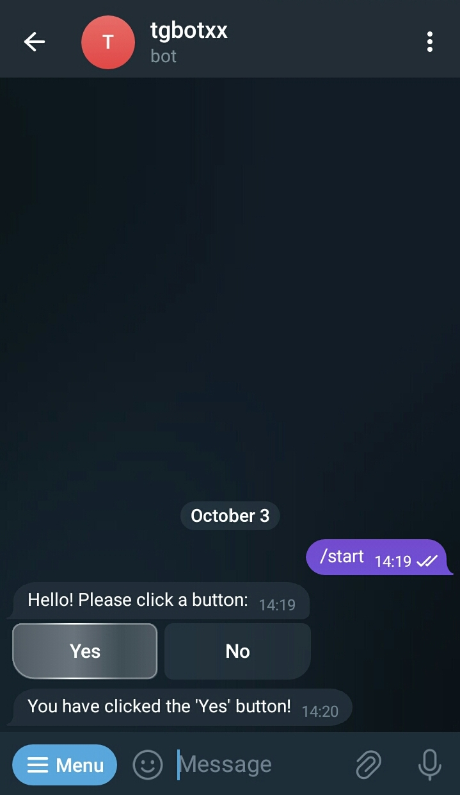

## buttons
This example shows how to program a basic Telegram Bot which you can use inline keyboard buttons to interact with users.

### Run
```bash
mkdir build && cd build
cmake .. -DCMAKE_BUILD_TYPE=Release
make -j8
./buttons YOUR_BOT_TOKEN
```

### How to create a new Bot and obtain its private token ?
1. Open the Telegram mobile app and search BotFather
2. Send BotFather a command /newbot
3. Follow instructions to create a new Bot
4. After you finish the instructions, you will receive a Bot Token, make sure you keep it secured.

### Preview

