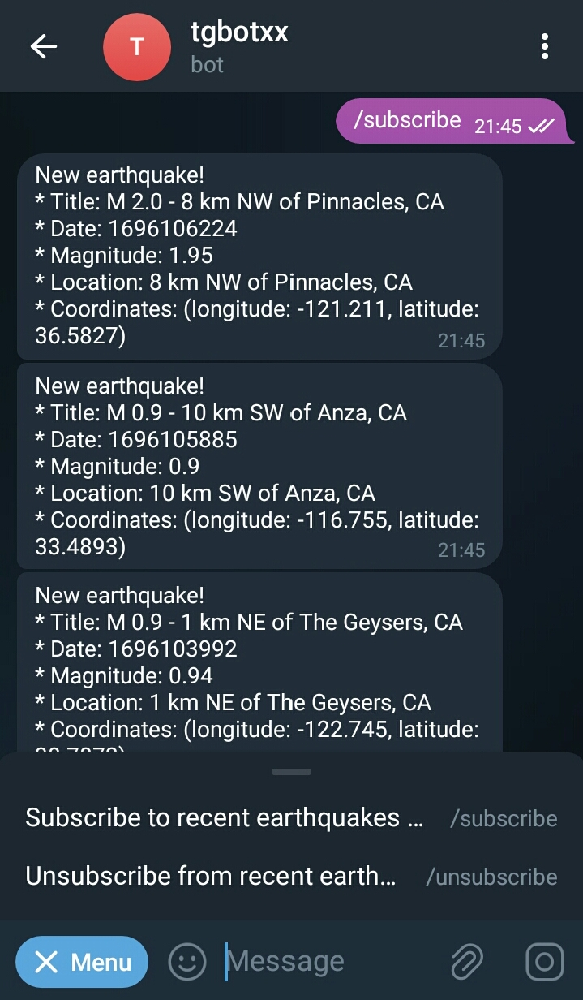
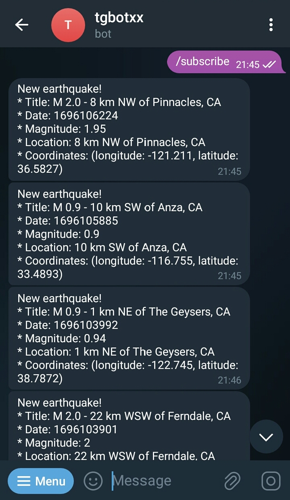

## earthquake_bot
This example shows how to program a Telegram Bot that will alert you if there is a recent earthquake somewhere in the world.

### How to create a new Bot and obtain its private token ?
1. Open the Telegram mobile app and search BotFather
2. Send BotFather a command /newbot
3. Follow instructions to create a new Bot
4. After you finish the instructions, you will receive a Bot Token, make sure you keep it secured. 

## Commands

## Alerts

